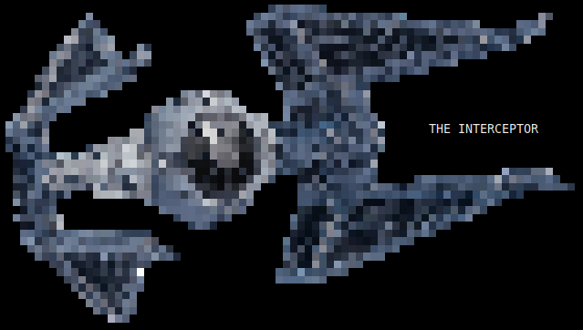

# Interceptor
middleman between the clients and your backend to add security or other verifications to the requests

## How a request normally works

The client sends a request to the backend. Either there is no authentication or the backend(-infrastructure) has to be extended which is not always possible.

## How a request with Interceptor works

The client sends a request to the backend (Interceptor) which does the authentication.
If the request is verified it's let through to the real backend.

